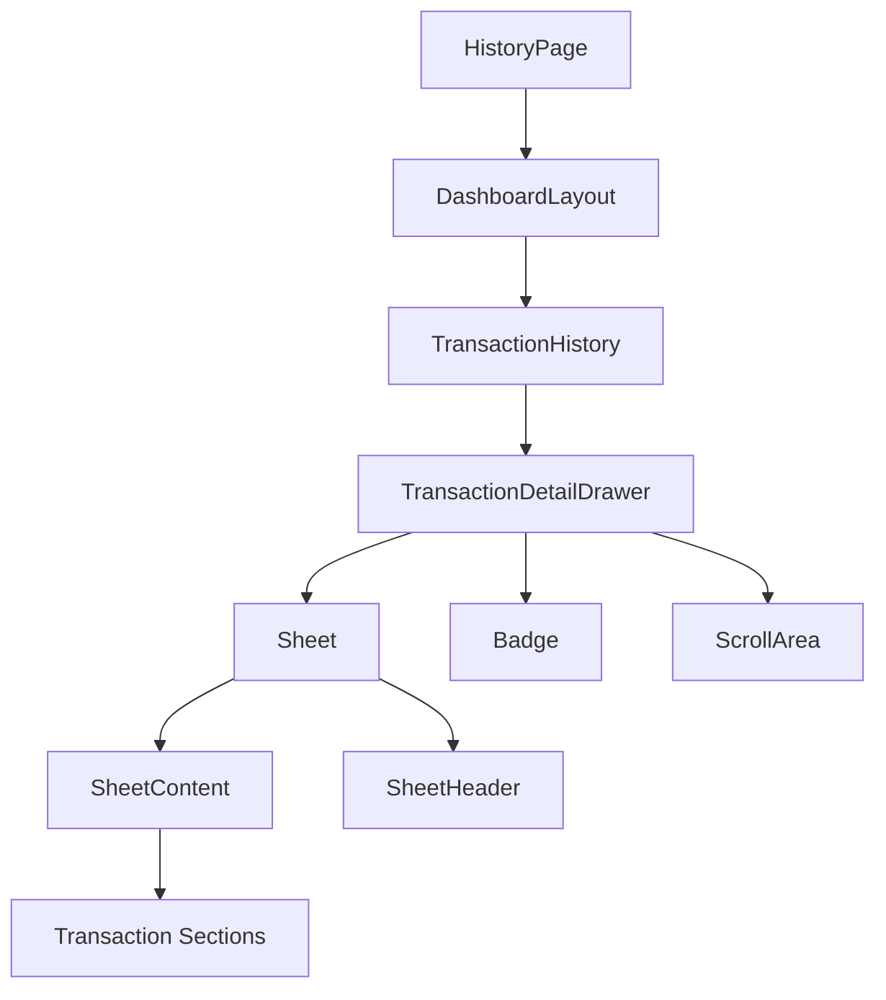
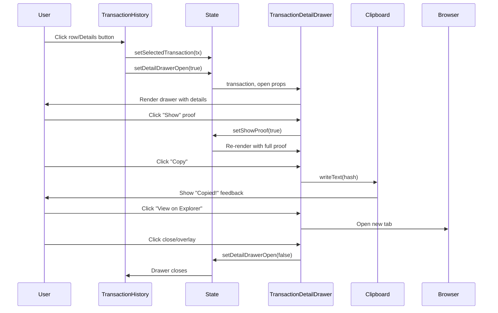
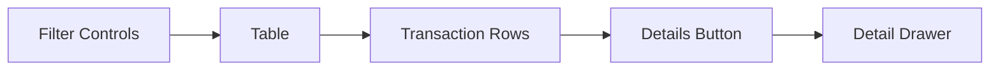

# Transaction Detail Architecture

## Component Hierarchy



## Data Flow



## State Management

### Component State

**TransactionHistory**:
```typescript
{
  filters: Filters,
  showFilters: boolean,
  selectedTransaction: PayrollTransaction | null,  // NEW
  detailDrawerOpen: boolean                       // NEW
}
```

**TransactionDetailDrawer**:
```typescript
{
  showProof: boolean,
  copiedField: string | null
}
```

### Props Interface

```typescript
interface TransactionDetailDrawerProps {
  transaction: PayrollTransaction | null;
  open: boolean;
  onOpenChange: (open: boolean) => void;
}
```

## Component Breakdown

### 1. TransactionHistory
**Responsibility**: List transactions, manage selection



**Key Methods**:
- `handleViewDetails(transaction)`: Opens drawer with selected transaction
- `handleExport()`: Exports filtered transactions
- `clearFilters()`: Resets all filters

### 2. TransactionDetailDrawer
**Responsibility**: Display comprehensive transaction details

**Sections**:
1. Header: Title, description, status
2. Summary: Amount, employee count
3. Timeline: Creation and verification dates
4. Verification: Status and ZK proof
5. Blockchain: Transaction hash and explorer link
6. Organization: Company information
7. Privacy Notice: Data protection info

**Key Methods**:
- `copyToClipboard(text, field)`: Copy with feedback
- `maskValue(value, chars)`: Mask sensitive values
- `getStatusIcon()`: Return status-specific icon
- `getStatusBadge()`: Return status-specific badge
- `formatDate(dateString)`: Format timestamps

### 3. UI Components

#### Sheet (Drawer)
**Based on**: `@radix-ui/react-dialog`

**Variants**:
- `side`: "left" | "right" | "top" | "bottom"

**Features**:
- Overlay backdrop
- Slide animation
- Focus trap
- Escape key handling
- Scroll locking

#### Badge
**Purpose**: Status indicators

**Variants**:
- `success`: Green (verified)
- `warning`: Yellow (pending)
- `destructive`: Red (failed)
- `default`: Gray
- `outline`: Border only
- `info`: Blue

#### ScrollArea
**Based on**: `@radix-ui/react-scroll-area`

**Features**:
- Custom scrollbar styling
- Smooth scrolling
- Viewport control

## Styling Strategy

### Tailwind Classes

**Spacing System**:
- `space-y-6`: Section spacing
- `gap-2`: Icon/text gaps
- `px-6 py-4`: Standard padding

**Color Palette**:
```css
/* Status Colors */
.verified   { @apply bg-green-100 text-green-800 }
.pending    { @apply bg-yellow-100 text-yellow-800 }
.failed     { @apply bg-red-100 text-red-800 }

/* Interaction Colors */
.primary    { @apply text-indigo-700 bg-indigo-50 hover:bg-indigo-100 }
.secondary  { @apply text-gray-700 bg-gray-100 hover:bg-gray-200 }
```

**Typography**:
```css
.heading-lg     { @apply text-2xl font-semibold }
.heading-sm     { @apply text-sm font-semibold }
.body           { @apply text-sm text-gray-900 }
.label          { @apply text-xs text-gray-500 }
.mono           { @apply font-mono text-sm }
```

### Responsive Design

**Breakpoints**:
- Mobile: < 640px (sm)
- Tablet: 640px - 1024px
- Desktop: > 1024px

**Drawer Width**:
- Mobile: 75% viewport width
- Desktop: max 576px (xl)

## Data Models

### PayrollTransaction

```typescript
interface PayrollTransaction {
  id: string;                    // Unique identifier
  companyId: string;             // Organization reference
  timestamp: string;             // Processing time (ISO 8601)
  createdAt: string;             // Creation time (ISO 8601)
  totalAmount: number;           // Total paid (in base currency)
  employeeCount: number;         // Number of employees
  proof: string;                 // Zero-knowledge proof
  status: TransactionStatus;     // Current status
  txHash?: string;               // Blockchain transaction hash
}

type TransactionStatus = "pending" | "verified" | "failed";
```

## Security Considerations

### Privacy Protection

1. **Default Masking**:
   - ZK proofs masked to first/last 12 chars
   - Only reveals on explicit user action
   - No individual salaries exposed

2. **Data Exposure**:
   ```typescript
   // ✅ Safe to show
   - Total amount
   - Employee count
   - Status
   - Timestamps
   - Transaction hash
   
   // ❌ Never exposed
   - Individual salaries
   - Employee personal info
   - Private keys
   - Unencrypted addresses
   ```

3. **External Links**:
   ```tsx
   <a 
     href={explorerUrl}
     target="_blank"
     rel="noopener noreferrer"  // Security attributes
   >
   ```

### Input Validation

```typescript
// All user inputs sanitized
if (!transaction) return null;  // Null check
if (value.length <= visibleChars * 2) return value;  // Bounds check
```

## Performance Optimizations

### 1. Conditional Rendering
```typescript
// Only render when open
{open && <DrawerContent />}
```

### 2. Event Delegation
```typescript
// Row click vs button click
onClick={(e) => {
  e.stopPropagation();  // Prevent row click
  handleViewDetails(tx);
}}
```

### 3. Memoization Opportunities
```typescript
// Can be memoized if needed
const formattedDate = useMemo(
  () => formatDate(transaction.createdAt),
  [transaction.createdAt]
);
```

### 4. Lazy Loading
```typescript
// Future optimization
const TransactionDetailDrawer = lazy(() => 
  import("./TransactionDetailDrawer")
);
```

## Accessibility Implementation

### ARIA Attributes

```tsx
<Sheet>
  <SheetTrigger aria-label="View transaction details" />
  <SheetContent aria-labelledby="sheet-title">
    <SheetTitle id="sheet-title">Transaction Details</SheetTitle>
    <SheetDescription>View complete information...</SheetDescription>
  </SheetContent>
</Sheet>
```

### Keyboard Navigation

- **Tab**: Navigate focusable elements
- **Escape**: Close drawer
- **Enter/Space**: Activate buttons
- **Shift+Tab**: Navigate backwards

### Screen Reader Support

```tsx
<span className="sr-only">Close</span>
<span aria-hidden="true">×</span>
```

## Error Handling

### Null Safety
```typescript
if (!transaction) return null;
```

### Optional Fields
```typescript
{transaction.txHash && (
  <BlockchainSection hash={transaction.txHash} />
)}
```

### Clipboard Fallback
```typescript
try {
  await navigator.clipboard.writeText(text);
  setCopiedField(fieldName);
} catch (error) {
  console.error("Clipboard error:", error);
  // Fallback to textarea method
}
```

## Testing Strategy

### Unit Tests
- Component rendering
- Status display logic
- Data formatting
- User interactions

### Integration Tests
- Drawer open/close flow
- Copy to clipboard
- External link navigation
- Keyboard navigation

### Accessibility Tests
- ARIA attributes present
- Keyboard navigation works
- Screen reader compatibility
- Color contrast ratios

## Extension Points

### 1. Add New Sections
```typescript
// In TransactionDetailDrawer.tsx
<section>
  <h4>Your Section</h4>
  <YourContent />
</section>
```

### 2. Custom Actions
```typescript
// Add action buttons
<SheetFooter>
  <Button onClick={handleCustomAction}>
    Custom Action
  </Button>
</SheetFooter>
```

### 3. Additional Data
```typescript
// Extend transaction type
interface ExtendedTransaction extends PayrollTransaction {
  customField: string;
}
```

## Dependencies Graph

```mermaid
graph TD
    A[TransactionDetailDrawer] --> B[@radix-ui/react-dialog]
    A --> C[@radix-ui/react-scroll-area]
    A --> D[lucide-react]
    A --> E[tailwind-merge]
    A --> F[class-variance-authority]
    
    G[Sheet] --> B
    H[ScrollArea] --> C
    I[Badge] --> F
    
    A --> G
    A --> H
    A --> I
```

## File Dependencies

```
TransactionDetailDrawer.tsx
├── components/ui/sheet.tsx
│   └── @radix-ui/react-dialog
├── components/ui/badge.tsx
│   └── class-variance-authority
├── components/ui/scroll-area.tsx
│   └── @radix-ui/react-scroll-area
├── types/index.ts
│   └── types/models.ts
└── lib/utils.ts
    ├── clsx
    └── tailwind-merge
```

## Build Output

### Bundle Size Impact
- `TransactionDetailDrawer.tsx`: ~8KB
- `sheet.tsx`: ~3KB
- `badge.tsx`: ~1KB
- `scroll-area.tsx`: ~2KB
- Radix packages: Already in bundle
- **Total Addition**: ~14KB minified

### Tree Shaking
All components use ES6 modules for optimal tree shaking.

## Browser Support

### Required Features
- ✅ ES6+ JavaScript
- ✅ CSS Grid & Flexbox
- ✅ Clipboard API (with fallback)
- ✅ CSS animations
- ✅ Radix UI primitives

### Tested Browsers
- Chrome/Edge 90+
- Firefox 88+
- Safari 14+
- Mobile browsers (iOS Safari, Chrome Android)

## Monitoring & Analytics

### Recommended Tracking

```typescript
// Track drawer opens
analytics.track("transaction_detail_viewed", {
  transactionId: transaction.id,
  status: transaction.status
});

// Track copy actions
analytics.track("transaction_hash_copied", {
  transactionId: transaction.id
});

// Track explorer visits
analytics.track("blockchain_explorer_opened", {
  transactionId: transaction.id
});
```

## Conclusion

This architecture provides a maintainable, accessible, and performant solution for viewing transaction details while maintaining privacy and security standards. The modular design allows for easy extension and customization.
