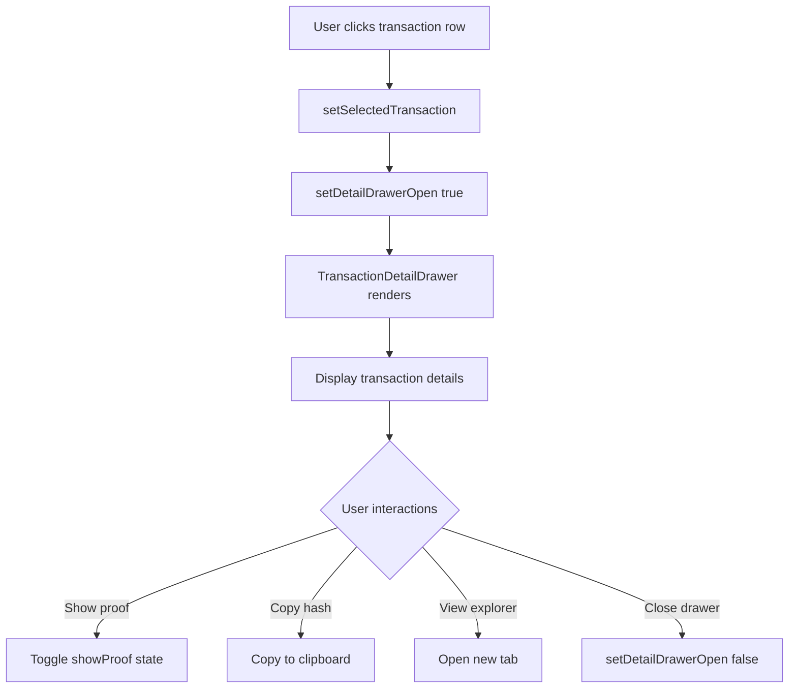

# Transaction Detail View Feature

## Overview

The Transaction Detail View provides operators and auditors with comprehensive information about payroll transactions while maintaining privacy protections and security standards.

## Features

### 1. **Detail Drawer Interface**
- **Slide-out drawer** opens from the right side of the screen
- **Scrollable content** for easy navigation of all transaction information
- **Responsive design** adapts to different screen sizes
- **Close mechanism** via overlay click, close button, or escape key

### 2. **Transaction Summary**
Displays high-level transaction information:
- Total amount paid (formatted with proper currency display)
- Number of employees paid
- Transaction ID (with copy functionality)
- Current verification status

### 3. **Timeline Information**
Shows key timestamps:
- **Created date/time**: When the transaction was initiated
- **Processed date/time**: When the transaction was verified/completed
- Formatted in human-readable format with both date and time

### 4. **Verification Status**
Comprehensive verification metadata:
- **Visual status indicators**: Icons and badges for verified/pending/failed states
- **Status descriptions**: Human-readable explanations of each status
- **Zero-Knowledge Proof**: 
  - Displayed with privacy controls (show/hide toggle)
  - Masked by default (shows first 12 and last 12 characters)
  - Copy to clipboard functionality
  - Full proof visible when requested

### 5. **Blockchain Details**
When available, shows:
- **Transaction hash**: Full blockchain transaction identifier
- **Copy functionality**: Quick copy to clipboard
- **Explorer link**: Direct link to Stellar Expert (opens in new tab)
- Properly formatted for readability

### 6. **Privacy Protection**
- **Sensitive values masked**: Individual salaries and personal data not exposed
- **Privacy notice**: Clear explanation of privacy protections
- **Aggregate data only**: Only totals and counts visible
- **ZK proof abstraction**: Technical details hidden by default

### 7. **Organization Information**
- Company/organization ID linked to the transaction
- Properly formatted and copyable

## User Interactions

### Opening the Detail View
Users can open transaction details in two ways:
1. **Click any table row** in the transaction history
2. **Click the "Details" button** in the actions column

### Viewing Sensitive Information
- ZK proofs are masked by default
- Click "Show" to reveal full proof
- Click "Hide" to mask again
- Copy button appears when proof is visible

### Copying Data
- Transaction hash can be copied with one click
- ZK proof can be copied when visible
- Visual feedback ("Copied!") confirms successful copy

### External Links
- "View on Explorer" opens Stellar Expert in new tab
- Links use proper security attributes (noopener, noreferrer)

## Security & Privacy Features

### 1. **Data Masking**
```typescript
const maskValue = (value: string, visibleChars = 8) => {
  if (value.length <= visibleChars * 2) return value;
  return `${value.slice(0, visibleChars)}...${value.slice(-visibleChars)}`;
};
```

### 2. **Progressive Disclosure**
- Sensitive information hidden by default
- User must explicitly request to view full details
- Clear visual indicators of privacy protection

### 3. **Privacy Notice**
Always displayed at bottom of drawer:
- Explains data protection measures
- Clarifies what information is encrypted
- Reassures users about privacy guarantees

## Component Architecture

### Main Components

#### `TransactionDetailDrawer`
**Location**: `components/features/transactions/TransactionDetailDrawer.tsx`

**Props**:
```typescript
interface TransactionDetailDrawerProps {
  transaction: PayrollTransaction | null;
  open: boolean;
  onOpenChange: (open: boolean) => void;
}
```

**State Management**:
- `showProof`: Controls ZK proof visibility
- `copiedField`: Tracks which field was recently copied

#### UI Components Used
- `Sheet`: Base drawer component (Radix UI Dialog)
- `Badge`: Status indicators
- `ScrollArea`: Scrollable content area
- Lucide icons for visual indicators

### Integration Points

#### `TransactionHistory` Component
Updated to include:
- Transaction selection state
- Drawer open/closed state
- Click handlers for opening details
- Hover effects on table rows
- Details button in actions column

## Technical Implementation

### Styling Approach
- **Tailwind CSS** for all styling
- **Consistent spacing**: 6-unit padding system
- **Color palette**: Gray scale with accent colors for status
- **Responsive breakpoints**: Mobile-first design

### Accessibility Features
- **ARIA labels** on all interactive elements
- **Screen reader support** via semantic HTML
- **Keyboard navigation** fully supported
- **Focus management** handled by Radix UI
- **Color contrast** meets WCAG AA standards

### Performance Considerations
- **Lazy rendering**: Drawer content only renders when open
- **Memoization**: Date formatting cached
- **Efficient re-renders**: State updates isolated to drawer
- **No unnecessary API calls**: Uses existing transaction data

## Status Indicators

### Verified Status
- **Icon**: Green checkmark circle
- **Badge**: Green background with "Verified" text
- **Description**: "This transaction has been cryptographically verified and is immutable on the blockchain."

### Pending Status
- **Icon**: Yellow clock
- **Badge**: Yellow background with "Pending" text
- **Description**: "This transaction is awaiting verification. The zero-knowledge proof is being processed."

### Failed Status
- **Icon**: Red X circle
- **Badge**: Red background with "Failed" text
- **Description**: "This transaction failed verification. Please contact support if you believe this is an error."

## Data Flow



## Testing

### Test Coverage
Test file: `__tests__/transaction-detail.test.tsx`

Covers:
- ✅ Rendering with transaction data
- ✅ Status display (verified, pending, failed)
- ✅ ZK proof masking/revealing
- ✅ Copy to clipboard functionality
- ✅ External links
- ✅ Privacy notices
- ✅ Null transaction handling
- ✅ Date formatting
- ✅ Conditional blockchain section

### Running Tests
```bash
npm test transaction-detail
```

## Future Enhancements

### Potential Improvements
1. **Download PDF**: Export transaction details as PDF report
2. **Email Details**: Send transaction summary via email
3. **Audit Trail**: Show complete history of status changes
4. **Related Transactions**: Link to related payroll runs
5. **Employee Breakdown**: Show aggregate stats by department
6. **Comparison View**: Compare with previous payroll runs
7. **Notes/Comments**: Add internal notes to transactions
8. **Attachments**: Link supporting documents

### API Integration
When backend is available:
- Fetch detailed transaction data on demand
- Load related audit logs
- Retrieve employee aggregates
- Pull compliance metadata

## Compliance & Audit Support

### Audit Requirements Met
- ✅ Complete transaction history
- ✅ Verification proof visibility
- ✅ Timestamp accuracy
- ✅ Immutable blockchain reference
- ✅ Privacy protection documentation
- ✅ Clear status indicators

### Regulatory Considerations
- **Data protection**: Complies with privacy regulations
- **Audit trail**: Maintains complete transaction records
- **Transparency**: Provides necessary visibility without exposing PII
- **Verification**: Cryptographic proof of correctness

## User Guide

### For Operators

**Viewing Transaction Details**:
1. Navigate to History page
2. Click any transaction row or "Details" button
3. Review transaction summary and status
4. Check verification proof if needed
5. View blockchain confirmation

**Copying Transaction Information**:
1. Open transaction details
2. Click "Copy" button next to hash or proof
3. Paste into your tool/report

**Verifying on Blockchain**:
1. Open transaction details
2. Click "View on Explorer"
3. Verify transaction on Stellar network

### For Auditors

**Verification Process**:
1. Review verification status and metadata
2. Check ZK proof for cryptographic validity
3. Verify transaction on blockchain explorer
4. Confirm timestamps match payroll schedule
5. Validate total amounts and employee counts

**Privacy Validation**:
1. Confirm no individual salaries are visible
2. Verify only aggregate totals shown
3. Check that employee identities are protected
4. Validate ZK proof provides necessary assurance

## Troubleshooting

### Common Issues

**Drawer not opening**:
- Check that transaction data is loaded
- Verify onClick handlers are attached
- Check browser console for errors

**Copy not working**:
- Ensure HTTPS connection (clipboard API requirement)
- Check browser permissions
- Verify navigator.clipboard is available

**Explorer link not working**:
- Confirm transaction has txHash
- Check network status (testnet vs mainnet)
- Verify Stellar Expert is accessible

## Dependencies

### Required Packages
- `@radix-ui/react-dialog`: ^1.1.17
- `@radix-ui/react-scroll-area`: ^1.2.12
- `lucide-react`: ^0.330.0
- `class-variance-authority`: ^0.7.1
- `tailwind-merge`: ^3.5.0

### UI Components
- `Sheet` (custom wrapper around Radix Dialog)
- `Badge` (custom component for status indicators)
- `ScrollArea` (custom wrapper around Radix ScrollArea)

## Acceptance Criteria Status

✅ **Users can open a transaction detail view from history**
- Implemented via row clicks and detail buttons
- Smooth drawer animation
- Responsive design

✅ **Verification metadata is understandable**
- Clear status indicators with icons
- Human-readable descriptions
- Organized sections with headers
- Visual hierarchy

✅ **Sensitive values remain protected**
- ZK proofs masked by default
- No individual salary exposure
- Privacy notice always visible
- Progressive disclosure pattern

## Conclusion

This implementation provides a professional, secure, and user-friendly way to inspect payroll transactions in detail. It balances transparency requirements with privacy protection, making it suitable for both operators and auditors while maintaining the zero-knowledge privacy guarantees of the payroll system.
